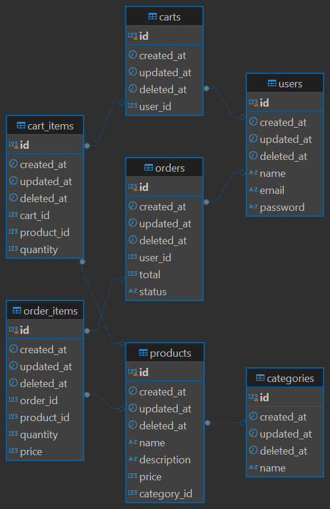

# ecommerce-api

A RESTful API for an e-commerce platform.

## Installation
1. Clone the repository
```bash
git clone https://github.com/irfanalmsyah/ecommerce-api.git
```

2. Change directory to the project
```bash
cd ecommerce-api
```

3. Run with docker compose
```bash
docker compose up
```

## API Documentation
### Auth
1. #### Register
```http
POST /register/
```

| Body | Type | Description |
| :--- | :--- | :--- |
| `name` | `string` | **Required**. User's name |
| `email` | `string` | **Required**. User's email |
| `password` | `string` | **Required**. User's password |

Example:
```http
POST /register/ HTTP/1.1
Host: localhost:3000
Content-Type: application/json

{
    "name": "aname",
    "email": "aname@gmail.com",
    "password": "apassword"
}
```

2. #### Login
```http
POST /login/
```

| Body | Type | Description |
| :--- | :--- | :--- |
| `email` | `string` | **Required**. User's email |
| `password` | `string` | **Required**. User's password |

Example:
```http
POST /login/ HTTP/1.1
Host: localhost:3000
Content-Type: application/json

{
    "email": "aemail@gmail.com",
    "password": "apassword"
}
```

### Protected
Use the token from login as [Bearer Token](https://swagger.io/docs/specification/v3_0/authentication/bearer-authentication/) to access the protected routes. 
1. #### Cart
```http
GET /cart/
```

Example:
```http
GET /cart/ HTTP/1.1
Host: localhost:3000
Authorization: Bearer <token>
```

2. #### Add to cart
```http
POST /cart/
```

| Body | Type | Description |
| :--- | :--- | :--- |
| `product_id` | `integer` | **Required**. Product's id |
| `quantity` | `integer` | **Required**. Quantity of the product |

Example:
```http
POST /cart/ HTTP/1.1
Host: localhost:3000
Content-Type: application/json
Authorization: Bearer <token>

{
    "product_id": 1,
    "quantity": 30
}
```

3. #### Remove product from cart
```http
DELETE /cart/
```

| Body | Type | Description |
| :--- | :--- | :--- |
| `product_id` | `integer` | **Required**. Product's id |

Example:
```http
DELETE /cart/ HTTP/1.1
Host: localhost:3000
Content-Type: application/json
Authorization: Bearer <token>

{
    "product_id": 1
}
```

4. #### All products
```http
GET /products/
```

Example:
```http
GET /products/ HTTP/1.1
Host: localhost:3000
Authorization: Bearer <token?
```

5. #### Products by category
```http
GET /products/?category=2
```

Example:
```http
GET /products/?category=2 HTTP/1.1
Host: localhost:3000
Authorization: Bearer <token?
```

6. #### Checkout
```http
POST /checkout/
```

Example:
```http
POST /checkout/ HTTP/1.1
Host: localhost:3000
Authorization: Bearer <token>
```

## Entity Relationship Diagram
